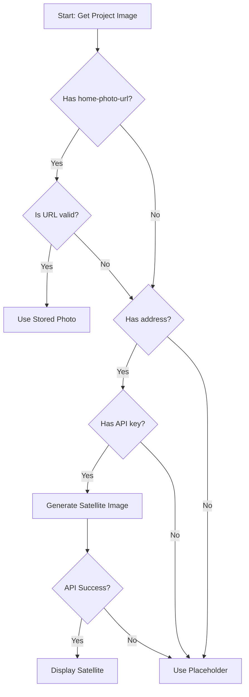

# Satellite/Aerial Image Implementation Guide

## Overview

The Aveyo Customer Portal displays satellite or aerial photographs of each customer's home on project cards and detail pages. This feature helps customers quickly identify their project and provides a professional, visual representation of the installation site.

This document outlines how to implement this feature in the mobile app, including image sourcing strategies, API integration, caching, and fallback mechanisms.

---

## Table of Contents

1. [Image Sources](#image-sources)
2. [Google Maps Static API Integration](#google-maps-static-api-integration)
3. [Fallback Strategy](#fallback-strategy)
4. [Implementation for Mobile](#implementation-for-mobile)
5. [Caching Strategy](#caching-strategy)
6. [Error Handling](#error-handling)
7. [Cost Optimization](#cost-optimization)
8. [Alternative Services](#alternative-services)

---

## Image Sources

### Primary Source: Google Maps Static API

The application uses **Google Maps Static API** to generate satellite/aerial imagery of the customer's home based on the project address.

**Advantages:**
- ✅ No need to store images in database
- ✅ Always up-to-date imagery
- ✅ Consistent quality and format
- ✅ Automatic geocoding from address
- ✅ Customizable zoom, size, and map type

**Disadvantages:**
- ❌ Requires API key and incurs costs
- ❌ Requires network connection
- ❌ API rate limits
- ❌ Potential for API quota exhaustion

### Secondary Source: Stored Photo URL

If available, use a pre-captured photo URL from Podio data.

**Field Location:** `podio_data.raw_payload['home-photo-url']`

**Advantages:**
- ✅ No API costs
- ✅ Faster loading (direct image URL)
- ✅ Can be custom photos taken by sales team
- ✅ No API dependency

**Disadvantages:**
- ❌ May not be available for all projects
- ❌ Requires storage solution
- ❌ Photos can become outdated
- ❌ Inconsistent quality/format

### Tertiary Source: Placeholder Image

Final fallback for projects with no address or photo URL.

---

## Google Maps Static API Integration

### API Setup

#### 1. Get API Key

1. Go to [Google Cloud Console](https://console.cloud.google.com/)
2. Create a new project or select existing project
3. Enable "Maps Static API"
4. Create credentials → API Key
5. Restrict API key (recommended):
   - Application restrictions: Set to your app's bundle ID (iOS) or package name (Android)
   - API restrictions: Restrict to "Maps Static API"

#### 2. Configure Environment Variables

Add to your Expo app configuration:

```bash
# .env or app.config.js
EXPO_PUBLIC_GOOGLE_MAPS_API_KEY=AIzaSy...your-key-here
```

### API Request Format

#### URL Structure

```
https://maps.googleapis.com/maps/api/staticmap?center={address}&zoom={zoom}&size={width}x{height}&maptype={maptype}&key={api_key}
```

#### Parameters

| Parameter | Type | Description | Example |
|-----------|------|-------------|---------|
| `center` | string | Address or lat/lng | `123+Solar+St,Phoenix,AZ` |
| `zoom` | integer | Zoom level (0-21) | `20` (very close) |
| `size` | string | Image dimensions | `600x300` |
| `maptype` | string | Map type | `satellite` or `hybrid` |
| `key` | string | Your API key | `AIzaSy...` |

#### Zoom Level Guide

| Zoom Level | View | Best For |
|------------|------|----------|
| 21 | Maximum zoom (25cm per pixel) | Very detailed roof view |
| 20 | Very close (50cm per pixel) | **Recommended - Clear roof/property view** |
| 19 | Close (1m per pixel) | House and immediate surroundings |
| 18 | Near (2.5m per pixel) | House and lot |
| 17 | Medium (5m per pixel) | House and street |
| 15-16 | Neighborhood view | Multiple houses visible |

**Recommendation:** Use zoom level `20` for optimal roof and property visibility while showing context.

#### Map Types

| Type | Description | Use Case |
|------|-------------|----------|
| `satellite` | Pure satellite imagery | **Recommended - Shows roof clearly** |
| `hybrid` | Satellite with roads/labels | Good for context with street names |
| `roadmap` | Standard map view | Not recommended (no aerial view) |
| `terrain` | Topographical | Not recommended for solar |

### Implementation Code

#### React Native / Expo

```typescript
// utils/projectUtils.ts

interface ImageDimensions {
  width: number;
  height: number;
}

/**
 * Generate a Google Maps satellite view URL from an address
 */
export const getSatelliteImageUrl = (
  address: string,
  zoom: number = 20,
  dimensions: ImageDimensions = { width: 600, height: 300 }
): string => {
  // Validate inputs
  if (!address || address.trim() === '') {
    return getPlaceholderImageUrl();
  }
  
  // Get API key from environment
  const apiKey = process.env.EXPO_PUBLIC_GOOGLE_MAPS_API_KEY;
  
  if (!apiKey) {
    console.warn('Google Maps API key not configured');
    return getPlaceholderImageUrl();
  }
  
  // Encode address for URL
  const encodedAddress = encodeURIComponent(address);
  
  // Construct API URL
  const url = [
    'https://maps.googleapis.com/maps/api/staticmap',
    `?center=${encodedAddress}`,
    `&zoom=${zoom}`,
    `&size=${dimensions.width}x${dimensions.height}`,
    `&maptype=satellite`,
    `&key=${apiKey}`
  ].join('');
  
  return url;
};

/**
 * Get placeholder image URL
 */
const getPlaceholderImageUrl = (): string => {
  return 'https://via.placeholder.com/600x300/e0e0e0/757575?text=House+Image+Unavailable';
};

/**
 * Get project home photo with fallback strategy
 */
export const getProjectHomePhotoUrl = (project: Project): string => {
  // Priority 1: Check for stored photo URL
  const storedPhotoUrl = project.podio_data?.raw_payload?.['home-photo-url'];
  if (storedPhotoUrl && isValidUrl(storedPhotoUrl)) {
    return storedPhotoUrl;
  }
  
  // Priority 2: Generate satellite image from address
  const address = getProjectAddress(project);
  if (address) {
    return getSatelliteImageUrl(address);
  }
  
  // Priority 3: Placeholder
  return getPlaceholderImageUrl();
};

/**
 * Validate URL
 */
const isValidUrl = (url: string): boolean => {
  try {
    new URL(url);
    return true;
  } catch {
    return false;
  }
};

/**
 * Get project address with fallbacks
 */
const getProjectAddress = (project: Project): string => {
  // Try direct address field
  if (project.address) return project.address;
  
  // Try podio raw_payload
  const payload = project.podio_data?.raw_payload;
  if (payload) {
    if (typeof payload === 'string') {
      try {
        const parsed = JSON.parse(payload);
        return parsed.address || parsed['project-address'] || '';
      } catch {
        return '';
      }
    } else {
      return payload.address || payload['project-address'] || '';
    }
  }
  
  return '';
};
```

### Usage in Components

#### Project Card Component

```tsx
import { Image } from 'react-native';
import { getProjectHomePhotoUrl } from '@/utils/projectUtils';

interface ProjectCardProps {
  project: Project;
}

export const ProjectCard: React.FC<ProjectCardProps> = ({ project }) => {
  const imageUrl = getProjectHomePhotoUrl(project);
  
  return (
    <View style={styles.card}>
      <Image
        source={{ uri: imageUrl }}
        style={styles.image}
        resizeMode="cover"
        onError={(error) => {
          console.warn('Failed to load project image:', error);
          // Optionally set fallback image state
        }}
      />
      {/* Rest of card content */}
    </View>
  );
};

const styles = StyleSheet.create({
  card: {
    borderRadius: 12,
    overflow: 'hidden',
    backgroundColor: '#fff',
    shadowColor: '#000',
    shadowOffset: { width: 0, height: 2 },
    shadowOpacity: 0.1,
    shadowRadius: 4,
    elevation: 3,
  },
  image: {
    width: '100%',
    height: 200,
    backgroundColor: '#e0e0e0',
  },
});
```

#### With Loading State

```tsx
import { Image, ActivityIndicator } from 'react-native';
import { useState } from 'react';

export const ProjectImage: React.FC<{ project: Project }> = ({ project }) => {
  const [loading, setLoading] = useState(true);
  const [error, setError] = useState(false);
  const imageUrl = getProjectHomePhotoUrl(project);
  
  return (
    <View style={styles.imageContainer}>
      {loading && (
        <ActivityIndicator
          size="large"
          color="#0F62DE"
          style={styles.loader}
        />
      )}
      <Image
        source={{ uri: error ? getPlaceholderImageUrl() : imageUrl }}
        style={styles.image}
        resizeMode="cover"
        onLoadStart={() => setLoading(true)}
        onLoadEnd={() => setLoading(false)}
        onError={() => {
          setLoading(false);
          setError(true);
        }}
      />
    </View>
  );
};
```

---

## Fallback Strategy

### Priority Order

```
1. Stored Photo URL (podio_data.raw_payload['home-photo-url'])
   ↓ (if not available)
2. Google Maps Satellite API (generated from address)
   ↓ (if address invalid or API fails)
3. Placeholder Image
```

### Decision Flow



### Implementation

```typescript
export const getProjectImageWithFallback = async (
  project: Project
): Promise<string> => {
  // 1. Try stored photo URL
  const storedUrl = project.podio_data?.raw_payload?.['home-photo-url'];
  if (storedUrl) {
    const isValid = await validateImageUrl(storedUrl);
    if (isValid) return storedUrl;
  }
  
  // 2. Try Google Maps API
  const address = getProjectAddress(project);
  if (address && process.env.EXPO_PUBLIC_GOOGLE_MAPS_API_KEY) {
    const satelliteUrl = getSatelliteImageUrl(address);
    return satelliteUrl; // API will return an image even if address is imprecise
  }
  
  // 3. Fallback to placeholder
  return getPlaceholderImageUrl();
};

/**
 * Validate that an image URL is accessible
 */
const validateImageUrl = async (url: string): Promise<boolean> => {
  try {
    const response = await fetch(url, { method: 'HEAD', timeout: 5000 });
    return response.ok;
  } catch {
    return false;
  }
};
```

---

## Caching Strategy

### Why Cache Images?

- Reduce API costs
- Improve load times
- Enable offline viewing
- Better user experience

### React Native Image Caching

#### Using Expo Image (Recommended)

```bash
npx expo install expo-image
```

```tsx
import { Image } from 'expo-image';

export const CachedProjectImage: React.FC<{ project: Project }> = ({ project }) => {
  const imageUrl = getProjectHomePhotoUrl(project);
  
  return (
    <Image
      source={{ uri: imageUrl }}
      style={styles.image}
      contentFit="cover"
      transition={200}
      cachePolicy="memory-disk" // Cache to disk for offline access
    />
  );
};
```

#### Using react-native-fast-image (Alternative)

```bash
npm install react-native-fast-image
```

```tsx
import FastImage from 'react-native-fast-image';

export const CachedProjectImage: React.FC<{ project: Project }> = ({ project }) => {
  const imageUrl = getProjectHomePhotoUrl(project);
  
  return (
    <FastImage
      source={{
        uri: imageUrl,
        priority: FastImage.priority.normal,
        cache: FastImage.cacheControl.immutable,
      }}
      style={styles.image}
      resizeMode={FastImage.resizeMode.cover}
    />
  );
};
```

### Cache Invalidation

Satellite images rarely change, so aggressive caching is appropriate:

```typescript
/**
 * Generate cache-friendly URL with version parameter
 */
export const getSatelliteImageUrlWithCache = (
  address: string,
  cacheKey?: string
): string => {
  const baseUrl = getSatelliteImageUrl(address);
  
  // Add cache busting parameter only when needed (e.g., after known address change)
  if (cacheKey) {
    return `${baseUrl}&v=${cacheKey}`;
  }
  
  return baseUrl;
};
```

### Storage Considerations

- **Average satellite image size:** 50-150 KB (depends on size and compression)
- **10 projects cached:** ~1 MB
- **50 projects cached:** ~5 MB
- **Recommended max cache:** 100 images or 10 MB

---

## Error Handling

### Common Errors and Solutions

#### 1. Invalid API Key

**Error:** HTTP 403 or "API key not valid"

**Solution:**
```typescript
const handleImageError = (error: any) => {
  if (error.status === 403) {
    console.error('Invalid Google Maps API key');
    analytics.error('image_load_failed', 'Invalid API key', 'project_card');
    // Show placeholder
    return getPlaceholderImageUrl();
  }
};
```

#### 2. Address Not Found

**Error:** Returns blank/generic image or map of wrong location

**Solution:**
- Validate address format before API call
- Use stored photo URL as primary if available
- Show "Location Not Available" placeholder

```typescript
const validateAddress = (address: string): boolean => {
  // Must have at least street and city/state
  const hasStreet = /\d+\s+\w+/.test(address);
  const hasLocation = /(,\s*\w+){1,2}/.test(address);
  return hasStreet && hasLocation;
};
```

#### 3. API Quota Exceeded

**Error:** HTTP 429 "Rate limit exceeded"

**Solution:**
```typescript
const handleQuotaExceeded = () => {
  console.warn('Google Maps API quota exceeded');
  analytics.error('api_quota_exceeded', 'Maps API', 'satellite_images');
  
  // Fall back to stored photos or placeholders
  // Consider showing a user-friendly message
  return getPlaceholderImageUrl();
};
```

#### 4. Network Timeout

**Error:** Request timeout or no response

**Solution:**
```tsx
const [imageError, setImageError] = useState(false);

<Image
  source={{ uri: imageUrl }}
  onError={() => setImageError(true)}
  onTimeout={() => setImageError(true)} // If supported
  timeout={10000} // 10 second timeout
/>

{imageError && (
  <Text style={styles.errorText}>
    Unable to load image
  </Text>
)}
```

### Error State UI

```tsx
export const ProjectImageWithError: React.FC<{ project: Project }> = ({ project }) => {
  const [error, setError] = useState(false);
  const imageUrl = getProjectHomePhotoUrl(project);
  
  if (error) {
    return (
      <View style={styles.errorContainer}>
        <Icon name="image-off" size={48} color="#757575" />
        <Text style={styles.errorText}>Image Unavailable</Text>
        <TouchableOpacity onPress={() => setError(false)}>
          <Text style={styles.retryText}>Retry</Text>
        </TouchableOpacity>
      </View>
    );
  }
  
  return (
    <Image
      source={{ uri: imageUrl }}
      style={styles.image}
      onError={() => setError(true)}
    />
  );
};
```

---

## Cost Optimization

### Google Maps Static API Pricing (as of 2024)

- **Free tier:** $200 credit per month (~28,000 requests)
- **Cost per request:** $0.007 per map load
- **Monthly cost example:**
  - 100 users × 10 projects × 5 views/month = 5,000 requests
  - 5,000 × $0.007 = **$35/month**

### Optimization Strategies

#### 1. Aggressive Caching

```typescript
// Cache images for 30 days
const CACHE_DURATION = 30 * 24 * 60 * 60 * 1000; // 30 days in ms

export const getCachedImageUrl = async (
  projectId: string,
  address: string
): Promise<string> => {
  const cacheKey = `satellite_${projectId}`;
  const cached = await AsyncStorage.getItem(cacheKey);
  
  if (cached) {
    const { url, timestamp } = JSON.parse(cached);
    const age = Date.now() - timestamp;
    
    if (age < CACHE_DURATION) {
      return url; // Use cached URL
    }
  }
  
  // Generate new URL
  const url = getSatelliteImageUrl(address);
  await AsyncStorage.setItem(cacheKey, JSON.stringify({
    url,
    timestamp: Date.now()
  }));
  
  return url;
};
```

#### 2. Lazy Loading

Only load images when they're visible on screen:

```tsx
import { useInView } from 'react-native-intersection-observer';

export const LazyProjectImage: React.FC<{ project: Project }> = ({ project }) => {
  const { ref, inView } = useInView({ threshold: 0.1 });
  const [imageUrl, setImageUrl] = useState<string | null>(null);
  
  useEffect(() => {
    if (inView && !imageUrl) {
      setImageUrl(getProjectHomePhotoUrl(project));
    }
  }, [inView, project]);
  
  return (
    <View ref={ref} style={styles.imageContainer}>
      {imageUrl ? (
        <Image source={{ uri: imageUrl }} style={styles.image} />
      ) : (
        <View style={styles.placeholder} />
      )}
    </View>
  );
};
```

#### 3. Reduce Image Size

Request smaller images for list views:

```typescript
// List view: smaller images
const listImageUrl = getSatelliteImageUrl(address, 18, { width: 400, height: 200 });

// Detail view: larger images
const detailImageUrl = getSatelliteImageUrl(address, 20, { width: 800, height: 400 });
```

#### 4. Prefetch on WiFi

```typescript
import NetInfo from '@react-native-community/netinfo';

export const prefetchProjectImages = async (projects: Project[]) => {
  const netInfo = await NetInfo.fetch();
  
  // Only prefetch on WiFi to save mobile data
  if (netInfo.type === 'wifi') {
    const urls = projects.map(p => getProjectHomePhotoUrl(p));
    await Image.prefetch(urls);
  }
};
```

#### 5. Prioritize Stored Photos

Prefer stored photo URLs (no API cost) over generated satellite images:

```typescript
export const getProjectHomePhotoUrl = (project: Project): string => {
  // PRIORITIZE stored photo URL (no API cost)
  const storedUrl = project.podio_data?.raw_payload?.['home-photo-url'];
  if (storedUrl) return storedUrl;
  
  // Fall back to satellite (API cost)
  const address = getProjectAddress(project);
  if (address) return getSatelliteImageUrl(address);
  
  return getPlaceholderImageUrl();
};
```

---

## Alternative Services

### Mapbox Static Images API

**Pricing:** More expensive than Google Maps  
**Quality:** Excellent  
**Setup:** Similar to Google Maps

```typescript
export const getMapboxSatelliteUrl = (
  address: string,
  zoom: number = 17
): string => {
  const token = process.env.EXPO_PUBLIC_MAPBOX_TOKEN;
  const encodedAddress = encodeURIComponent(address);
  
  return `https://api.mapbox.com/styles/v1/mapbox/satellite-v9/static/${encodedAddress}/${zoom}/600x300?access_token=${token}`;
};
```

### Microsoft Bing Maps Static API

**Pricing:** Similar to Google Maps  
**Quality:** Good  
**Setup:** Requires Bing Maps API key

```typescript
export const getBingSatelliteUrl = (
  address: string,
  zoom: number = 19
): string => {
  const apiKey = process.env.EXPO_PUBLIC_BING_MAPS_KEY;
  const encodedAddress = encodeURIComponent(address);
  
  return `https://dev.virtualearth.net/REST/v1/Imagery/Map/Aerial/${encodedAddress}?zoomLevel=${zoom}&mapSize=600,300&key=${apiKey}`;
};
```

### OpenStreetMap (Free but Limited)

**Pricing:** Free  
**Quality:** No satellite imagery (only map tiles)  
**Not Recommended:** Doesn't provide aerial/satellite views

---

## Mobile-Specific Considerations

### Platform Differences

#### iOS

- Use `Image` component from `react-native` or `expo-image`
- Supports automatic caching with `expo-image`
- Consider using `react-native-fast-image` for better performance

#### Android

- Same components work
- May need additional permissions for caching large files
- Test on various Android versions

### Permissions

No special permissions required for displaying remote images, but for caching:

**iOS:** No additional permissions needed  
**Android:** Storage access handled automatically by RN

### Performance Tips

1. **Use appropriate image sizes** based on screen density
2. **Implement progressive loading** (blur placeholder → full image)
3. **Monitor memory usage** with large image lists
4. **Use FlatList** with `windowSize` prop for long project lists

```tsx
<FlatList
  data={projects}
  renderItem={({ item }) => <ProjectCard project={item} />}
  keyExtractor={(item) => item.id}
  windowSize={5} // Only render 5 screens worth of content
  removeClippedSubviews={true} // Optimize memory
  maxToRenderPerBatch={10}
  updateCellsBatchingPeriod={50}
/>
```

---

## Testing Checklist

- [ ] Images load correctly for projects with valid addresses
- [ ] Fallback to placeholder works when address is missing
- [ ] Fallback to placeholder works when API key is invalid
- [ ] Images are cached and load faster on subsequent views
- [ ] Error states display appropriately
- [ ] Loading states show while images are fetching
- [ ] Works on both iOS and Android
- [ ] Works on slow network connections
- [ ] Handles offline scenarios gracefully
- [ ] Images display correctly in list view and detail view
- [ ] API costs are within expected range
- [ ] Memory usage is acceptable with 50+ projects

---

## Example Implementation Checklist

### Setup Phase
- [ ] Obtain Google Maps API key
- [ ] Add API key to environment variables
- [ ] Restrict API key in Google Cloud Console
- [ ] Set up billing alerts in Google Cloud

### Code Implementation
- [ ] Create `getSatelliteImageUrl()` utility function
- [ ] Create `getProjectHomePhotoUrl()` with fallback logic
- [ ] Implement image caching (expo-image or fast-image)
- [ ] Add loading states to image components
- [ ] Add error handling and retry logic
- [ ] Implement placeholder images

### Optimization
- [ ] Add lazy loading for images in lists
- [ ] Implement prefetching strategy
- [ ] Set appropriate cache duration
- [ ] Optimize image dimensions for mobile screens
- [ ] Add analytics for image load failures

### Testing
- [ ] Test with various address formats
- [ ] Test with missing addresses
- [ ] Test with invalid API key
- [ ] Test offline behavior
- [ ] Monitor API usage and costs
- [ ] Test on iOS and Android devices

---

## Summary

### Quick Reference

**Best Practices:**
1. Use Google Maps Static API with zoom level 20
2. Implement 3-tier fallback: Stored URL → Satellite → Placeholder
3. Cache images aggressively (30 days)
4. Lazy load images in lists
5. Prefetch on WiFi only
6. Monitor API costs and set billing alerts

**Key Files:**
- `utils/projectUtils.ts` - Image URL generation and fallback logic
- `.env` - API key configuration
- Project card components - Image display with loading/error states

**Cost Estimate:**
- Small app (100 users): ~$10-30/month
- Medium app (500 users): ~$50-150/month
- Add billing alerts at $50 and $100

---

**Document Version**: 1.0  
**Last Updated**: November 2024  
**Maintained By**: Aveyo Development Team

